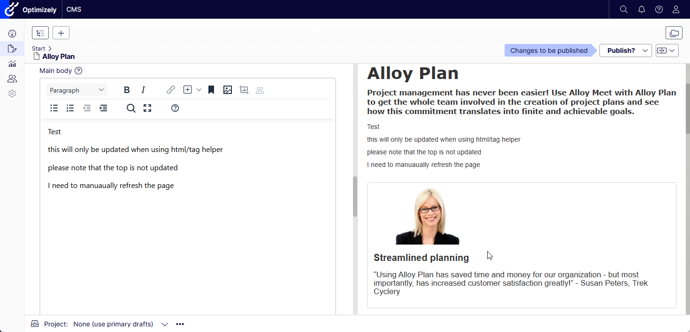
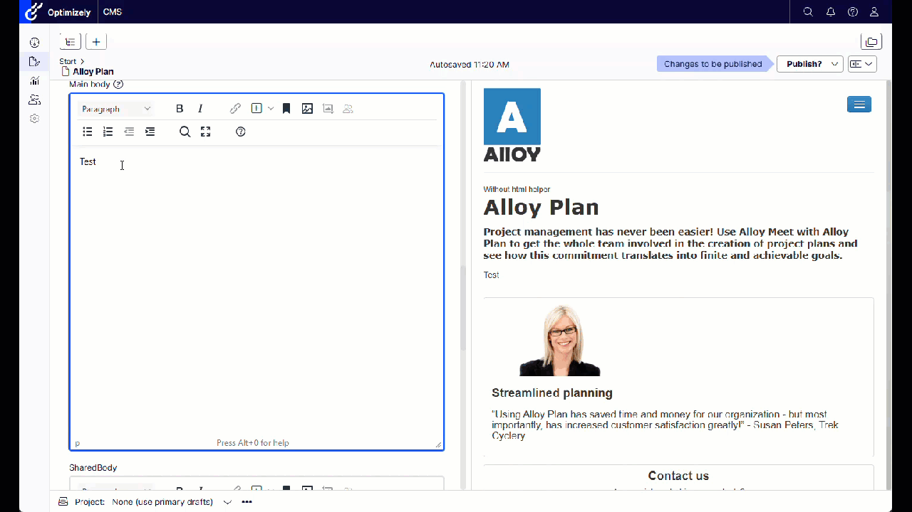

# Side by side editing in Optimizely CMS

[](https://github.com/barteksekula/side-by-side-editing/actions/workflows/side-by-side-editing.yml)

This a nice improvement add-on for Editors. It's very easy to install, uses only the public API and requires no configuration.
It's available for free from https://nuget.optimizely.com/package/?id=SideBySideEditing and can be installed to any Optimizely CMS12+



## Requirements

* .NET Core 6+
* CMS 12+

## Introduction

This package is an alternative editing view which additionally presents a preview on the right hand side.
The preview is automatically refreshed after each save.

The On-Page Edit view which is built-in to Optimizely CMS is very powerful. 
However, it is also quite challenging to configure correctly and often I saw that many people simply disabled it and switched to All-properties mode.

This add-on tries to deliver best of both worlds.
You will still use the All-properties mode for editing, however will still be able to see the real-time rendering.

This addon's most powerful feature is the simplicity. You just need to install the nuget, turn the module on and that's it.
There are no restrictions on how the delivery should be rendered (as opposed to the built-in On-page edit which requires specific data-epi attributes).
There is no need to use Html/Tag helpers or render data-epi manually.
The preview is just refreshed automatically behind the scenes.


## Install

```
Install-Package SideBySideEditing
```

https://nuget.optimizely.com/package/?id=SideBySideEditing

In order to start using SideBySideEditing you need to add it explicitly to your site.
Please add the following statement to your Startup.cs

```csharp
public class Startup
{
    ...
    public void ConfigureServices(IServiceCollection services)
    {
        ...
        services.AddSideBySideEditing();
        ...
    }
    ...
}
```

_AddSideBySideEditing_ extension method also accepts optional parameter of Action<SideBySideEditingOptions> which
lets you configure the add-on according to your needs.

List of available options

 | Option        | Default           | Description  |
 | ---- | ---- | ---- |
 | RegisterIframeAutoRefresher | true | Auto-refresh the preview iframe in the side-by-side view. If your views use tag/html helpers and render all `data-epi` attributes correctly you can turn this off. |

# Automatic preview refresh

By default, the preview just refreshes itself behind the scenes after each successful Save operation.
Very important to note is that there are no restrictions on the delivery site. There is no need to use HtmlHelpers or TagHelpers which
render *data-epi** attributes or to render those manually.

If your delivery correctly renders **data-epi** attributes, and you don't want the preview to be automatically reloaded you can:

```csharp
public class Startup
{
    ...
    public void ConfigureServices(IServiceCollection services)
    {
        ...
        services.AddSideBySideEditing(options =>
        {
            options.RegisterIframeAutoRefresher = false;
        });
        ...
    }
    ...
}
```

In that way the preview will of course work more seamlessly and faster because only a small part of the page is updated behind the scenes.



# For contributors

This is our personal project that we intend to maintain.

If you would like to contribute in any way, create a new feature, fix a bug or help with the documentation then we would really appreciate any kind of contributions.

# Bug reporting

We really appreciate bug reports. But please make sure that you include as many details as possible.
We spent a lot of time on setting up the solution so it's possible to run the whole thing by just cloning the repo and
calling a single command.
That makes it super easy for you to fork this repo and create a reproducible environment.
That will significantly speed up a potential bugfix release for you.

Please remember that this is our personal project developed during our free time and any kind of help from
users is highly appreciated.

## Development (if you would like to help in development)

```console
setup.cmd
```

And then you can either run the sample Alloy from VS, VS code or Rider. Or you can also run from the command line via `dotnet run`

## Creating a new package

In order to create a new local nuget you have to build first

```console
build.cmd Release
```

and then run

```console
pack.cmd Release
```
that creates a nuget package based on the version taken from `build/version.props`
